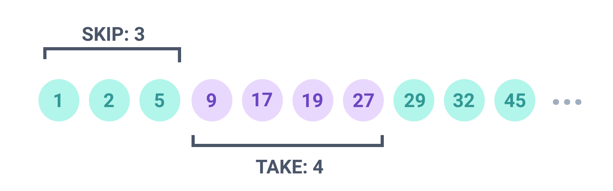

## Exploring Prisma With Blog Application Part-1

Starter Pack GitHub: https://github.com/Apollo-Level2-Web-Dev/next-blog-starter

Next Blog Server GitHub: https://github.com/Apollo-Level2-Web-Dev/next-blog-server

## 49-1 Clone Starter Project and Run
- clone the repo and setup
- lets install prisma

[prisma with postgres](https://www.prisma.io/docs/getting-started/setup-prisma/start-from-scratch/relational-databases-typescript-prismaPostgres)

```
npm install prisma typescript tsx @types/node --save-dev

```

```
npx prisma init
```

- set the env from here 

[env](https://www.prisma.io/docs/getting-started/setup-prisma/start-from-scratch/relational-databases/connect-your-database-typescript-postgresql)

## 49-2 Setup Prisma in Starter Project
- install the prisma client as we have not migrated yet for t5his project 

```
npm install @prisma/client
```
- still not auto suggestion coming ? 

```
npx prisma generate
```
- src -> config -> db.ts (this is the prisma client configuration)

```ts 
import { PrismaClient } from "@prisma/client";

export const prisma = new PrismaClient();


```
- src -> server.ts 

```ts 
async function connectToDB() {
  try {
    await prisma.$connect()
    console.log("Database Is Connected")
  } catch (error) {
    console.log("Database Db Connection Failed");
    process.exit(1)
  }
}
async function startServer() {
  try {
    await connectToDB();
    server = http.createServer(app);
    server.listen(process.env.PORT, () => {
      console.log(`🚀 Server is running on port ${process.env.PORT}`);
    });

    handleProcessEvents();
  } catch (error) {
    console.error("❌ Error during server startup:", error);
    process.exit(1);
  }
}
```

```ts 
import http, { Server } from "http";
import app from "./app";
import dotenv from "dotenv";
import { prisma } from "./config/db";

dotenv.config();

let server: Server | null = null;

async function connectToDB() {
  try {
    await prisma.$connect()
    console.log("Database Is Connected")
  } catch (error) {
    console.log("Database Db Connection Failed");
    process.exit(1)
  }
}
async function startServer() {
  try {
    await connectToDB();
    server = http.createServer(app);
    server.listen(process.env.PORT, () => {
      console.log(`🚀 Server is running on port ${process.env.PORT}`);
    });

    handleProcessEvents();
  } catch (error) {
    console.error("❌ Error during server startup:", error);
    process.exit(1);
  }
}

/**
 * Gracefully shutdown the server and close database connections.
 * @param {string} signal - The termination signal received.
 */
async function gracefulShutdown(signal: string) {
  console.warn(`🔄 Received ${signal}, shutting down gracefully...`);

  if (server) {
    server.close(async () => {
      console.log("✅ HTTP server closed.");

      try {
        console.log("Server shutdown complete.");
      } catch (error) {
        console.error("❌ Error during shutdown:", error);
      }

      process.exit(0);
    });
  } else {
    process.exit(0);
  }
}

/**
 * Handle system signals and unexpected errors.
 */
function handleProcessEvents() {
  process.on("SIGTERM", () => gracefulShutdown("SIGTERM"));
  process.on("SIGINT", () => gracefulShutdown("SIGINT"));

  process.on("uncaughtException", (error) => {
    console.error("💥 Uncaught Exception:", error);
    gracefulShutdown("uncaughtException");
  });

  process.on("unhandledRejection", (reason) => {
    console.error("💥 Unhandled Rejection:", reason);
    gracefulShutdown("unhandledRejection");
  });
}

// Start the application
startServer();

```

## 49-3 Requirement Analysis (User, Post)
- there is a bug in connecting the database 
- as we have nothing inside schema and we didn't do any migration so the bridge is not created for this reason this error is coming  
- prisma -> prisma.schema (create user schema)

```prisma 
// This is your Prisma schema file,
// learn more about it in the docs: https://pris.ly/d/prisma-schema

// Looking for ways to speed up your queries, or scale easily with your serverless or edge functions?
// Try Prisma Accelerate: https://pris.ly/cli/accelerate-init

generator client {
  provider = "prisma-client-js"
}

datasource db {
  provider = "postgresql"
  url      = env("DATABASE_URL")
}

model User {
  id Int @id @default(autoincrement())
}
```
- migrate it 

```
npx prisma migrate dev
```
- now run 

```
npm run dev
```
- now this will run the server 

#### Lets understand the Blog App project first 



## 49-4 Write User and Post Models in Prisma Schema
- user and post Schema

```prisma
// This is your Prisma schema file,
// learn more about it in the docs: https://pris.ly/d/prisma-schema

// Looking for ways to speed up your queries, or scale easily with your serverless or edge functions?
// Try Prisma Accelerate: https://pris.ly/cli/accelerate-init

generator client {
  provider = "prisma-client-js"
}

datasource db {
  provider = "postgresql"
  url      = env("DATABASE_URL")
}

model User {
  id         Int        @id @default(autoincrement())
  name       String
  email      String
  password   String?
  role       Role       @default(USER)
  phone      String
  picture    String?
  status     UserStatus @default(ACTIVE)
  isVerified Boolean    @default(false)
  createdAt  DateTime   @default(now())
  updatedAt  DateTime   @updatedAt
}

model Post {
  id         Int      @id @default(autoincrement())
  title      String
  content    String
  thumbnail  String?
  isFeatured Boolean  @default(false)
  tags       String[]
  views      Int      @default(0)
  authorId   Int
  createdAt  DateTime @default(now())
  updatedAt  DateTime @updatedAt
}

enum Role {
  SUPER_ADMIN
  ADMIN
  USER
}

enum UserStatus {
  ACTIVE
  INACTIVE
  BLOCKED
}

```
- migrate it 

```
npx prisma migrate dev
```

## 49-5 One-to-Many Relation in Prisma